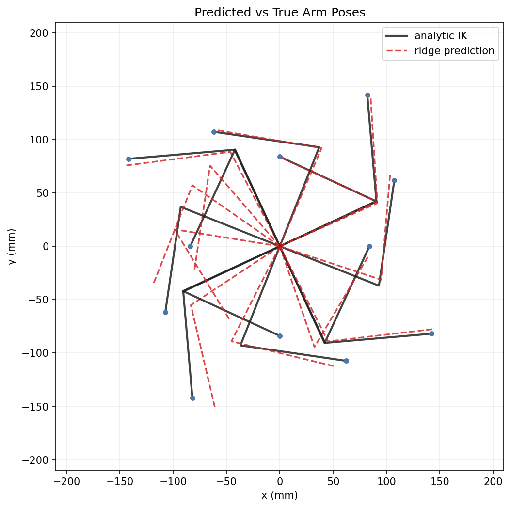
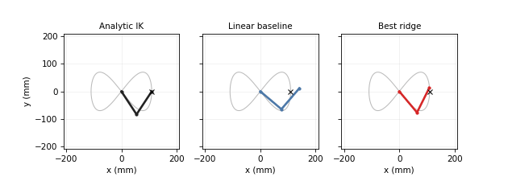

# Planar IK with Regularized Linear Models





Learn inverse kinematics for a 2-DOF planar robot arm using linear models, polynomial feature lifting, and L2 regularization. The project is intentionally small but engineering-shaped: the arm has a closed-form analytic inverse kinematics solution, so every prediction can be checked against ground-truth geometry and reported as end-effector error in millimeters.

## Project Arc

The central question is: how far can Chapter 3 linear models go on a robotics problem before a neural network becomes the natural next tool?

1. **Linear baseline**: fit linear regression from target position `(x, y)` to joint angles `(theta_1, theta_2)`. This should fail in a measurable way because inverse kinematics is nonlinear.
2. **Polynomial lifting**: map `(x, y)` into degree-`d` polynomial features, then fit linear models in the lifted space.
3. **Ridge regularization**: sweep `lambda` to show the bias-variance tradeoff, coefficient shrinkage, and improved conditioning of `X^T X + lambda I`.
4. **Robotics evaluation**: convert predicted joint angles back through forward kinematics and report positional error in millimeters.
5. **MLP motivation**: document the remaining error floor at fixed polynomial degree and use it to motivate the follow-up neural-network version.

## Problem Setup

For a planar arm with link lengths `l1` and `l2`, the dataset samples reachable end-effector targets and computes analytic inverse kinematics labels for a consistent elbow branch.

- **Input**: end-effector target `(x, y)`
- **Output**: joint angles `(theta_1, theta_2)`
- **Ground truth**: closed-form inverse kinematics
- **Primary metric**: end-effector error after forward kinematics, reported in millimeters
- **Secondary metrics**: angle RMSE, validation MSE, coefficient norms, and condition numbers

## Repository Layout

```text
configs/default.yaml                         Experiment configuration
data/raw/                                    Optional source data
data/processed/                              Generated train/validation/test data
notebooks/01_inverse_kinematics_story.ipynb  Colab-style narrative notebook
scripts/run_experiment.py                    Train and evaluate model sweeps
scripts/make_plots.py                        Generate validation curves and heatmaps
scripts/animate_trajectory.py                Render trajectory comparison animations
src/planar_ik/datasets.py                    Dataset generation and splits
src/planar_ik/geometry.py                    Forward and inverse kinematics
src/planar_ik/features.py                    Polynomial feature construction
src/planar_ik/models.py                      Linear and ridge models
src/planar_ik/metrics.py                     Error metrics
src/planar_ik/experiments.py                 Sweep orchestration
src/planar_ik/plots.py                       Visualization helpers
tests/                                       Unit tests for geometry and models
artifacts/                                   Generated experiment outputs
reports/figures/                             README-ready plots and figures
```

## Intended Workflow

```powershell
python -m venv .venv
.\.venv\Scripts\Activate.ps1
python -m pip install -U pip
python -m pip install -e ".[dev]"
```

Run the study:

```powershell
python scripts/run_experiment.py --config configs/default.yaml --parity-check
python scripts/make_plots.py --run artifacts/latest
python scripts/animate_trajectory.py --run artifacts/latest
pytest
```

The expected outputs are validation curves, ridge coefficient paths, conditioning plots, workspace error heatmaps, and an animation comparing the learned arm pose against the analytic solution on a target trajectory.

## Results

Default run: `seeds = [42, 0, 1, 2, 3]`, errors are mean +/- std end-effector error in millimeters.

| Model | Train | Val | Test |
| --- | ---: | ---: | ---: |
| Linear baseline | 126.7 +/- 0.9 | 126.4 +/- 1.3 | 127.3 +/- 2.0 |
| Best unregularized polynomial, degree 25 | 20.3 +/- 0.4 | 21.4 +/- 0.9 | 20.9 +/- 1.4 |
| Ridge at fixed degree 35, lambda 1.61e+00 | 22.2 +/- 0.6 | 23.1 +/- 1.4 | 22.6 +/- 1.5 |
| Ridge joint grid optimum, per-seed selection (seed 42: degree 29, lambda 3.16e-4) | 18.7 +/- 0.4 | 19.3 +/- 0.8 | 19.2 +/- 1.2 |

For the notebook anchor seed (`seed=42`), the joint grid selects degree 29 with lambda `3.16e-4`, giving 18.94 mm validation and 18.46 mm test error. The single aggregate heatmap cell with the lowest mean validation error is degree 25 with lambda `1.78e-5`, at 20.24 mm validation and 19.59 mm test.

## Experiments

The default study runs:

- Raw linear regression on `(x, y)`
- Unregularized polynomial degrees `1` through `43`
- Ridge penalties across log-spaced `lambda` values at degree `35`
- A joint degree/lambda grid over degrees `15` through `45`
- Multiple random seeds for train/validation/test splits
- Optional PyTorch parity check against the from-scratch closed-form implementation via `--parity-check`

The final report should emphasize how plain linear regression fails, why high-degree polynomial regression overfits without regularization, and how ridge stabilizes the model by shrinking coefficients and improving matrix conditioning.

## Metrics to Report

- Mean, median, and 95th-percentile end-effector error in millimeters
- Joint-angle RMSE in radians or degrees
- Validation error versus `lambda`
- Coefficient norm versus `lambda`
- Condition number of `X^T X + lambda I`
- Error heatmap over the reachable workspace

## Limitations and Next Steps

Polynomial ridge regression is still a global linear model in a hand-built feature space. It reduces mean end-effector error to about 19 mm under per-seed grid selection, but the residuals are structured near the workspace boundary and singular configurations. The next version of this project should replace polynomial lifting with an MLP and compare whether learned nonlinear features reduce that error floor.

Other extensions:

- Model both elbow-up and elbow-down IK branches explicitly
- Add target noise and measure robustness
- Compare closed-form ridge against gradient-based optimization
- Export a short portfolio animation for the best baseline and ridge models


## License

MIT License. See [LICENSE](LICENSE).
